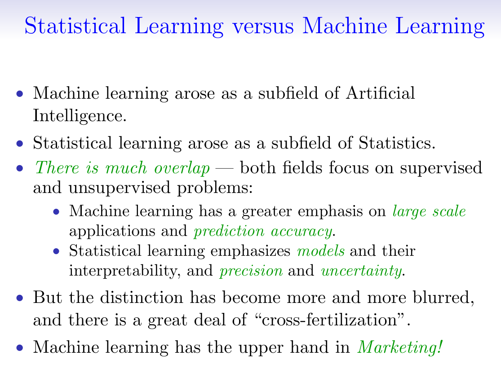

### Notes on random froests

[Stanford Lagunita's statistical learning course](https://lagunita.stanford.edu/courses/HumanitiesSciences/StatLearning/Winter2016/info) has some excellent lectures on random forests. It starts with explanations of decision trees, followed by bagged trees and random forests, and ends with boosting. From these lectures it seems that:

1. The term "predictors" in statistical learning = "features" in machine learning.
2. The main idea of random forests of dropping predictors for individual trees and aggregate by majority or average is the same as the idea of dropout in neural networks, where a proportion of neurons in the hidden layers are dropped temporarily during different minibatches of training, effectively averaging over an emsemble of subnetworks. Both tricks are used as regularisations, i.e. to reduce the variance. The only difference is: in random forests, all but a square root number of the total number of features are dropped, whereas the dropout ratio in neural networks is usually a half.

By the way, here's a comparison between statistical learning and machine learning from the slides of the Statistcal Learning course:

