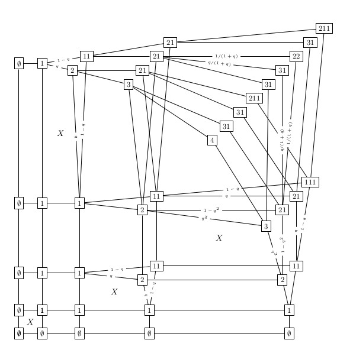

In [this paper](http://link.springer.com/article/10.1007/s10801-014-0505-x) a symmetry property analogous to the well known symmetry
property of the normal Robinson-Schensted algorithm has been shown for
the \\(q\\)-weighted Robinson-Schensted algorithm. The proof uses a
generalisation of the growth diagram approach introduced by Fomin. This
approach, which uses "growth graphs", can also be applied to a wider
class of insertion algorithms which have a branching structure.

Above is the growth graph of the \\(q\\)-weighted Robinson-Schensted
algorithm for the permutation \\({1 2 3 4\\choose1 4 2 3}\\).
